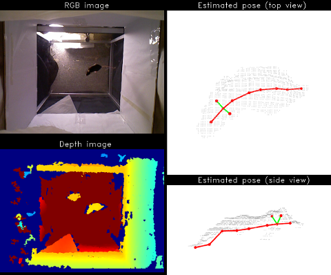
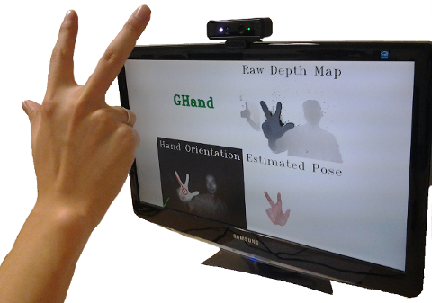
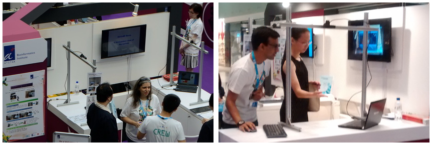
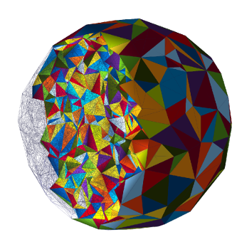

:toc: left
:toclevels: 2
:stem: latexmath
:toc-title: Ashwin Nanjappa
:last-update-label!:
:notitle:
:figure-caption!:

= Ashwin Nanjappa

++++
<h2 style="text-align: center">Ashwin Nanjappa</h2>
++++

I am a **post-doctoral research fellow** at the http://www.bii.a-star.edu.sg/[**A*STAR Bioinformatics Institute**] in Singapore.
I work with http://web.bii.a-star.edu.sg/~chengli/[**Prof. Cheng Li**] on **GPU**-accelerated **machine learning** algorithms for solving **computer vision** problems using commodity **depth cameras** like **XBox Kinect**.

I obtained my **Ph.D.** at the http://nus.edu.sg/[**National University of Singapore (NUS)**] under the guidance of http://www.comp.nus.edu.sg/~tants/[**Prof. Tan Tiow Seng**].
For my PhD thesis, I created the very first **GPU-accelerated computational geometry algorithms** for solving 3D **Delaunay triangulation** and regular triangulation problems.
My **CUDA** implementations are highly optimized and are currently the **fastest** (with over 10x speedup over **CGAL**) and are proven to deliver stable and robust results.

++++
 

++++

== Research

My research focuses on designing **GPU-accelerated algorithms** for solving problems in machine vision and 3D computational geometry.
I particularly like solutions that have **elegance** in both algorithm and source code.
My source code implementations are highly optimized to utilize the complex massively parallel GPU architecture to the fullest.

=== Mouse pose estimation

.Demo of 3D mouse pose estimation shows input depth image and estimated pose in top and side views

I am developing a realtime algorithm for full-body **pose estimation of mouse** using depth images.
It estimates poses of a 24-joint simplified mouse model in realtime, including the spine, limbs and paws.
It works with different depth cameras and types of rodents, thus enabling neuroscientists to study behavorial phenotyping.

==== Publications

* **Mouse pose estimation from depth images** +
(joint work with Li Cheng, Wei Gao, Chi Xu, Adam Claridge-Chang and Zoe Bichler) +
link:papers/mouse_arxiv2015.pdf[Paper]
•
http://arxiv.org/abs/1511.07611v1[arXiv]

=== Hand pose estimation

++++

    <iframe width="560" height="315" src="https://www.youtube.com/embed/QS0oyGz_zSQ" frameborder="0" allowfullscreen></iframe>

 
++++

.Demo of GHand system

[.text-center]
.GHand booth at Singapore Science Festival 2014. Our system was tried by hundreds of visitors.

**GHand** is a GPU-accelerated algorithm developed for realtime **hand pose estimation** from depth cameras like Kinect, Primesense or SoftKinetic.
It can estimate full 3D hand pose with an average joint error of 20mm.
It runs fully on the GPU with a realtime performance of 64FPS.

GHand has been demoed successfully in conferences to researchers and in science festivals to the public.
It has been found to work well in different camera setups for hands of all shapes, colors and sizes with no prior calibration.

==== Publications

* **GHand: A GPU algorithm for realtime hand pose estimation using depth camera** +
(joint work with Chi Xu and Li Cheng) +
Eurographics, 2015 +
link:papers/ghand_eurographics2015.pdf[Paper]
•
https://www.youtube.com/watch?v=QS0oyGz_zSQ[Video]
•
http://dx.doi.org/10.2312/egp.20151033[DOI]

* **Estimate Hand Poses Efficiently from Single Depth Images** +
(joint work with Chi Xu, Xiaowei Zhang and Li Cheng) +
International Journal of Computer Vision (IJCV), 2015 +
link:papers/hand_ijcv2015.pdf[Paper]
•
http://dx.doi.org/10.1007/s11263-015-0826-9[DOI]

* **Real-time hand pose estimation from depth camera using GPU** +
(joint work with Chi Xu and Li Cheng) +
GPU Technology Conference 2014 (South East Asia) +
link:papers/ghand_poster.pdf[Poster]
•
link:papers/ghand_poster.bib[BibTeX]

==== Demos

* **Hand Pose Estimation Demo Booth** +
Best Booth Award, A*STAR Scientific Conference (ASC) 2014 +
http://www.bii.a-star.edu.sg/aboutBII/news.php?newsid=34[News]

* **Efficient hand pose estimation from single depth images** +
X-periment!, Singapore Science Festival, 2014 +
link:papers/ghand_xperiment.pdf[Poster]

=== Delaunay triangulation

++++

  <iframe width="560" height="315" src="https://www.youtube.com/embed/tEfXYMfHSLI" frameborder="0" allowfullscreen></iframe>

 
++++

For my PhD thesis, I developed **GPU-accelerated algorithms** for **3D Delaunay triangulation** and 3D regular triangulation.
The overarching ideas are to maximize utilization of the massively parallel resources in GPU by dualizing discrete Voronoi, fixing 4D convex hull using star splaying and parallel insertion and fixing of triangulation.
Implementations of these algorithms in CUDA are highly optimized and the runtimes are 5-10x faster when compared to the venerable **CGAL**.

==== Publications

* **GeomGPU: Algorithms of computational geometry on the GPU** +
(joint work with Thanh-Tung Cao, Mingcen Gao, Meng Qi and Tiow-Seng Tan) +
http://www.geomgpu.net/book[Book website] +
(Work in progress)

* **Delaunay mesh generation using the GPU** +
(joint work with Thanh-Tung Cao, Mingcen Gao, Meng Qi, Tiow-Seng Tan and Zhiyong Huang) +
http://myycai.wix.com/nvidia[Merit Award], NVIDIA Poster Contest, +
GPU Technology Conference 2014 (South East Asia) +
link:papers/gdel_poster.pdf[Poster]
•
link:papers/gdel_poster.bib[BibTeX]

* **A GPU accelerated algorithm for 3D Delaunay triangulation** +
(joint work with Thanh-Tung Cao, Mingcen Gao and Tiow-Seng Tan) +
ACM SIGGRAPH Symposium on Interactive 3D Graphics and Games (I3D), 2014 +
link:papers/gdel3d_paper.pdf[Paper]
•
https://www.youtube.com/watch?v=tEfXYMfHSLI[Video]
•
https://github.com/ashwin/gDel3D[Code]
•
link:papers/gdel3d_paper.bib[BibTeX]
•
http://dx.doi.org/10.1145/2556700.2556710[DOI]

* **gHull: A GPU algorithm for 3D Convex Hull** +
(joint work with Mingcen Gao, Thanh-Tung Cao and Tiow-Seng Tan) +
ACM Transactions on Mathematical Software (TOMS), 2013 +
link:papers/ghull.pdf[Paper]
•
https://www.youtube.com/watch?v=pCpzahAVAzo[Video]
•
link:papers/ghull.bib[BibTeX]
•
http://dx.doi.org/10.1145/2513109.2513112[DOI]

* **Delaunay triangulation in R³ on the GPU** +
PhD Thesis, National University of Singapore, 2012 +
link:papers/gdel3d_thesis.pdf[Thesis]
•
Code [https://github.com/ashwin/gstar4d[1], https://github.com/ashwin/greg3d[2]]
•
link:papers/gdel3d_thesis.bib[BibTeX]

== Code

Source code from my research, my PhD and other projects can be found at Github https://github.com/ashwin[here].
Some of the popular ones are listed here:

=== gStar4D

The **gStar4D** algorithm computes the 3D Delaunay triangulation on the GPU.
The CUDA implementation of gStar4D is robust and achieves a speedup of up to 5 times over the 3D Delaunay triangulator of CGAL.

The gStar4D algorithm uses neighbourhood information in the 3D digital Voronoi diagram as an approximation of the 3D Delaunay triangulation.
It uses this to perform massively parallel creation of stars of each input point lifted to 4D and employs an unique star splaying approach to splay these 4D stars in parallel and make them consistent.
The result is the 3D Delaunay triangulation of the input constructed fully on the GPU.

* https://github.com/ashwin/gStar4D[Code]

=== gDel3D

The **gDel3D** algorithm constructs the Delaunay Triangulation of a set of points in 3D using the GPU.
The algorithm utilizes a novel combination of incremental insertion, flipping and star splaying to construct Delaunay.
The CUDA implementation is robust and its runtime is 10 times faster when compared to the Delaunay triangulator of **CGAL**.

* https://github.com/ashwin/gDel3D[Code]

=== gReg3D

The **gReg3D** algorithm computes the 3D regular (weighted Delaunay) triangulation on the GPU.
Our CUDA implementation of gReg3D is robust and achieves a speedup of up to 4 times over the 3D regular triangulator of CGAL.

The gReg3D algorithm extends the star splaying concepts of the gStar4D and gDel3D algorithms to construct the 3D regular (weighted Delaunay) triangulation on the GPU.
This algorithm allows stars to die, finds their death certificate and uses methods to propagate this information to other stars efficiently.
The result is the 3D regular triangulation of the input computed fully on the GPU.

* https://github.com/ashwin/gReg3D[Code]

=== GPU Coursera

I created this library of code to work offline on the assignments of **Heterogenous Parallel Programming**, a GPU/CUDA course offered by **Coursera**.
Many folks chipped in and have converted this into an easy to use library for the course.

* https://github.com/ashwin/coursera-heterogeneous[Code]

